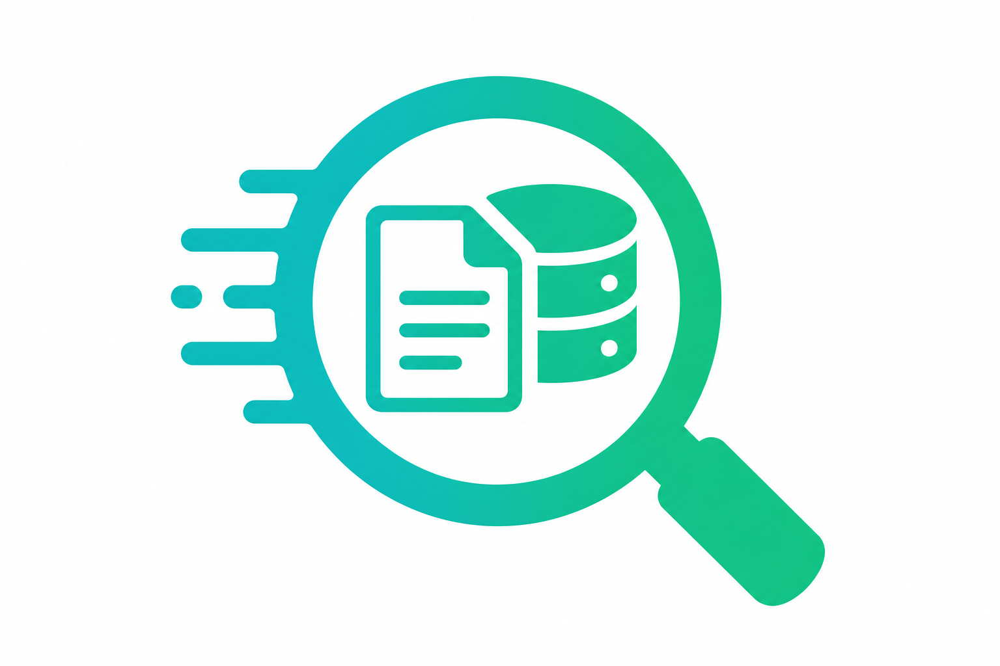

<p align="center">
  
</p>

<h1 align="center">FlashRAG</h1>

<p align="center">
  <a href="https://pypi.org/project/flashrag/"></a>
  <a href="https://github.com/Gaurav14cs17/FlashVision/actions"></a>
  
  
  
  
  
</p>

<p align="center">
  <b>Production-grade Retrieval-Augmented Generation — vector databases, document retrieval, embedding models, knowledge-grounded QA</b>
</p>

<p align="center">
  <a href="#installation">Install</a> •
  <a href="#usage">Usage</a> •
  <a href="#pipelines">Pipelines</a> •
  <a href="#embeddings">Embeddings</a> •
  <a href="#retrieval">Retrieval</a> •
  <a href="#examples">Examples</a> •
  <a href="#contributing">Contributing</a>
</p>

---

## What is FlashRAG?

FlashRAG is an end-to-end framework for building Retrieval-Augmented Generation systems. It provides a `pip`-installable Python package with a CLI, a high-level Python API, and built-in solutions for document QA, knowledge bases, and research assistance.

```bash
pip install -e .
flashrag index --docs ./my_docs/ --embedding all-MiniLM-L6-v2
flashrag query --question "What is attention?" --top-k 5
flashrag chat --model gpt2
```

---

## Installation

### pip (recommended)

```bash
pip install flashrag

# With all extras
pip install "flashrag[all]"
```

### From source (for development)

```bash
git clone https://github.com/Gaurav14cs17/FlashVision.git
cd FlashVision/FlashRAG
pip install -e ".[all]"
```

### Optional extras

```bash
pip install -e ".[openai]"    # OpenAI embeddings & generation
pip install -e ".[pdf]"       # PDF document loading
pip install -e ".[vision]"    # CLIP/SigLIP image embeddings
pip install -e ".[all]"       # Everything
```

### Verify installation

```bash
flashrag check       # runs full health check
flashrag settings    # shows Python, PyTorch, CUDA, GPU info
flashrag version     # prints version
```

---

## Usage

### Python API

```python
from flashrag import FlashRAG, VectorStore, BasicRAGPipeline, DocumentQA

# Quick document QA
qa = DocumentQA(embedding_model="all-MiniLM-L6-v2", generator_model="gpt2")
qa.add_documents(["doc1.pdf", "doc2.md"])
answer = qa.ask("What is the main contribution?")
print(answer)

# Build a RAG pipeline
pipeline = BasicRAGPipeline(
    embedding_model="all-MiniLM-L6-v2",
    generator_model="gpt2",
    top_k=5,
)
result = pipeline.run("Explain transformer attention")
print(result["answer"])
print(result["sources"])
```

### CLI

```bash
# Index documents
flashrag index --docs ./papers/ --embedding all-MiniLM-L6-v2

# Query
flashrag query --question "What is self-attention?" --top-k 5

# Interactive chat with RAG
flashrag chat --model gpt2 --index ./my_index

# Benchmark retrieval
flashrag benchmark --dataset nq --embedding all-MiniLM-L6-v2
```

---

## Pipelines

| Pipeline | Description |
|----------|-------------|
| `BasicRAGPipeline` | Retrieve → Generate (standard RAG) |
| `AgenticRAGPipeline` | Agent-driven adaptive retrieval with query routing |
| `MultimodalRAGPipeline` | Text + Image retrieval and generation |
| `CorrectiveRAGPipeline` | Self-corrective RAG with relevance grading (CRAG) |

```python
from flashrag.pipelines import BasicRAGPipeline, AgenticRAGPipeline

# Standard RAG
pipe = BasicRAGPipeline(embedding_model="all-MiniLM-L6-v2", generator_model="gpt2")
result = pipe.run("What causes rain?")

# Agentic RAG with query decomposition
pipe = AgenticRAGPipeline(embedding_model="all-MiniLM-L6-v2", generator_model="gpt2")
result = pipe.run("Compare TCP and UDP protocols")
```

---

## Embeddings

FlashRAG supports multiple embedding backends:

| Backend | Model Examples | Use Case |
|---------|---------------|----------|
| SentenceTransformer | all-MiniLM-L6-v2, bge-large | Text embeddings |
| OpenAI | text-embedding-3-small | API-based embeddings |
| CLIP/SigLIP | openai/clip-vit-base-patch32 | Image + text embeddings |

```python
from flashrag.embeddings import SentenceTransformerEmbedding, OpenAIEmbedding

embed = SentenceTransformerEmbedding("all-MiniLM-L6-v2")
vectors = embed.encode(["Hello world", "FlashRAG is great"])
```

---

## Retrieval

| Method | Description |
|--------|-------------|
| `VectorStore` | FAISS-backed dense vector search |
| `BM25Retriever` | TF-IDF sparse retrieval |
| `HybridSearch` | Dense + sparse with reciprocal-rank fusion |
| `CrossEncoderReranker` | Cross-encoder reranking for precision |

```python
from flashrag.retrieval import VectorStore, HybridSearch

# Dense retrieval
store = VectorStore(dimension=384)
store.add(vectors, documents)
results = store.search(query_vector, top_k=10)

# Hybrid search
hybrid = HybridSearch(embedding_model="all-MiniLM-L6-v2")
hybrid.index(documents)
results = hybrid.search("What is attention?", top_k=10)
```

---

## Examples

Ready-to-run scripts in the [`examples/`](examples/) folder:

| Script | What it does |
|--------|--------------|
| `basic_rag.py` | Standard retrieve-then-generate pipeline |
| `multimodal_rag.py` | Text + image retrieval and QA |
| `hybrid_search.py` | Hybrid dense + sparse search |
| `agentic_rag.py` | Agent-driven adaptive retrieval |
| `benchmark_rag.py` | Benchmark retrieval metrics |

```bash
cd examples
python basic_rag.py
python benchmark_rag.py
```

---

## Project Structure

```
FlashRAG/
├── flashrag/                  # Main package (pip install -e .)
│   ├── __init__.py            # Public API
│   ├── cli.py                 # CLI entry point (flashrag command)
│   ├── registry.py            # Pluggable component registry
│   ├── cfg/                   # Configuration + YAML loading
│   ├── data/                  # Document loaders, chunkers, preprocessors
│   ├── engine/                # Trainer, Validator, Predictor, Exporter
│   ├── embeddings/            # SentenceTransformer, OpenAI, CLIP embeddings
│   ├── retrieval/             # VectorStore, BM25, HybridSearch, Reranker
│   ├── generation/            # LLM generation, prompt templates, citations
│   ├── pipelines/             # BasicRAG, AgenticRAG, MultimodalRAG, CRAG
│   ├── solutions/             # DocumentQA, KnowledgeBase, ResearchAssistant
│   ├── analytics/             # Benchmark, Recall@K, MRR, NDCG, faithfulness
│   └── utils/                 # I/O, visualization, callbacks
├── configs/                   # YAML configs
├── examples/                  # Ready-to-run example scripts
├── tests/                     # Unit tests (pytest)
├── docs/                      # Documentation
├── docker/                    # Dockerfile + docker-compose
├── pyproject.toml             # Package configuration
├── CONTRIBUTING.md            # How to contribute
├── CHANGELOG.md               # Version history
└── LICENSE                    # MIT
```

---

## Docker

```bash
# Build
docker build -t flashrag -f docker/Dockerfile .

# Index and query
docker run flashrag index --docs /data/docs/ --embedding all-MiniLM-L6-v2
docker run flashrag query --question "What is RAG?"

# docker-compose
cd docker && docker compose up
```

---

## Contributing

We welcome contributions! See [CONTRIBUTING.md](CONTRIBUTING.md) for guidelines.

```bash
git clone https://github.com/Gaurav14cs17/FlashVision.git
cd FlashVision/FlashRAG
pip install -e ".[dev,all]"
ruff check flashrag/
pytest tests/ -v
flashrag check
```

---

## License

MIT License — see [LICENSE](LICENSE) for details.

---

<p align="center">
  <a href="https://github.com/Gaurav14cs17/FlashVision">
    <b>FlashVision</b>
  </a>
  — Open-source lightweight AI
</p>
